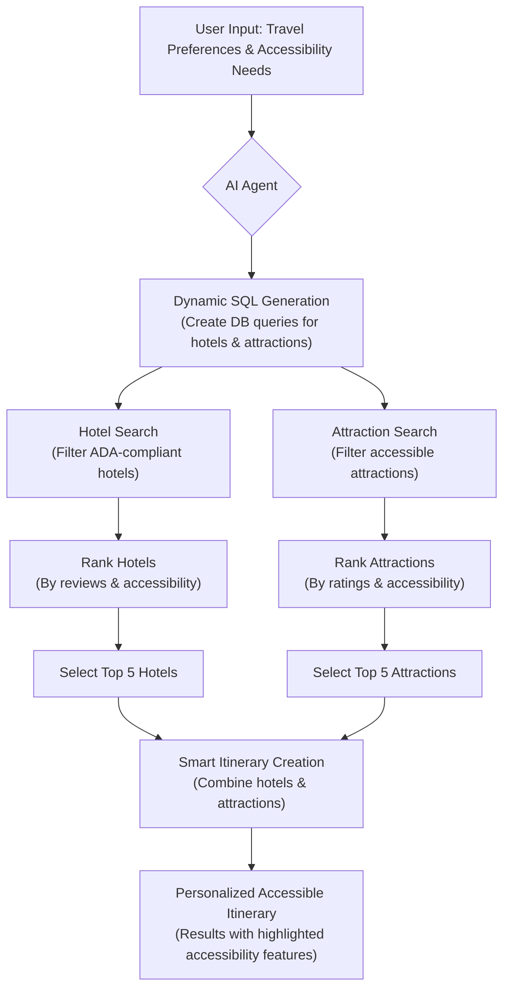

# Companio: AI-Powered ADA Travel Assistant

## Project Summary for PowerPoint

### 🎯 Project Overview

An AI-driven travel planning system that intelligently searches and recommends ADA-compliant hotels and attractions, generating personalized accessible itineraries for users with disabilities.

---

## Workflow

## 🤖 AI Features

- **Dynamic SQL Generation:**  
    AI automatically creates database queries based on user preferences and accessibility needs.

- **Intelligent Recommendations:**  
    Machine learning algorithms rank and select the top 5 hotels/attractions based on ratings and ADA compliance.

- **Smart Itinerary Creation:**  
    AI synthesizes hotel and attraction data into comprehensive, accessible travel plans.

---

## 🏨 AI Agent - Hotel Booking

- Searches ADA-compliant accommodations using keywords: *wheelchair*, *accessible*, *ADA*, *disabled*, *mobility*.
- Filters by location, availability, and accessibility features.
- Ranks hotels by review scores (1-10 scale) and accessibility quality.

---

## 🎭 AI Agent - Attractions

- Identifies tourist attractions with disability accommodations.
- Analyzes `services_provided` field for accessibility features.
- Recommends top-rated accessible attractions by location.

---

## ♿ Disability Search Features

- **Keyword Recognition:**  
    Automatically detects accessibility-related terms in user input.

- **ADA Compliance Filtering:**  
    Searches property highlights and services for wheelchair access, accessible bathrooms, and mobility aids.

- **Personalized Matching:**  
    Matches specific disability needs with appropriate accommodations and attractions.

- **Structured Results:**  
    Displays accessibility features prominently in recommendations.
